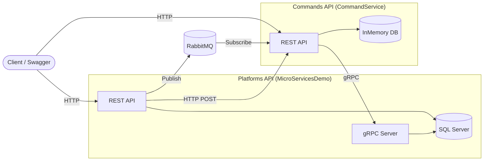

# MicroServicesDemo

A .NET 10 microservices demo built for **personal learning and hands-on practice**. It consists of two independent services — **Platforms** and **Commands** — that communicate over synchronous HTTP, asynchronous messaging (RabbitMQ), and gRPC.

## What It Does

The app manages game platforms (e.g. Steam, Xbox) and CLI-style commands associated with each platform:

- **Platforms API** — Creates, lists, and stores platforms in SQL Server.
- **Commands API** — Manages commands per platform (list, create, get).

When a new platform is created:

1. Platforms API saves it to SQL Server.
2. It sends the platform to Command Service via **synchronous HTTP**.
3. It publishes a `Platform_Published` event to **RabbitMQ**; Command Service listens and adds the platform to its own database.
4. On startup, Command Service seeds its database by fetching all platforms from Platforms API over **gRPC**.

## Architecture



## Tech Stack

| Layer | Technology |
|-------|------------|
| Framework | .NET 10, ASP.NET Core Web API |
| Database | SQL Server (Platforms), InMemory (Commands) |
| ORM | Entity Framework Core |
| Messaging | RabbitMQ (Fanout exchange) |
| RPC | gRPC |
| Mapping | AutoMapper |
| API docs | Swagger / Swashbuckle |
| Container | Docker |
| Orchestration | Kubernetes (Ingress, ClusterIP, LoadBalancer) |

## Project Structure

```
MicroServicesDemo/
├── MicroServicesDemo/          # Platforms API
│   ├── Controllers/              # Platform CRUD endpoints
│   ├── Data/                     # EF Core, SQL Server repository
│   ├── AsyncDataServices/        # RabbitMQ publisher
│   ├── SyncDataServices/Http/    # HTTP client → Command Service
│   └── SyncDataServices/Http/Grpc/  # gRPC server
│
├── CommandService/               # Commands API
│   ├── Controllers/              # Platform & Command endpoints
│   ├── Data/                     # InMemory repository, seed logic
│   ├── AsyncDataServices/        # RabbitMQ subscriber
│   ├── EventProcessing/          # Event handler (Platform_Published)
│   └── SyncDataServices/Grpc/    # gRPC client → Platforms API
│
├── K8S/                          # Kubernetes manifests
│   ├── microservicedemo-depl.yaml
│   ├── commands-deply.yaml
│   ├── ingress-srv.yaml
│   ├── mssql-plat-depl.yaml
│   └── rabbitmq-depl.yaml
│
└── Dockerfile                    # Platforms API image
```

## Services

### Platforms API (`MicroServicesDemo`)

| Property | Value |
|----------|-------|
| Port (local) | HTTP `5000`, HTTPS `5001` |
| Database | SQL Server (`platformsdb`) |
| Swagger | `http://localhost:5000/swagger` |

**Endpoints:**

| Method | Path | Description |
|--------|------|-------------|
| GET | `/api/Platforms` | List all platforms |
| GET | `/api/Platforms/{id}` | Get a single platform |
| POST | `/api/Platforms` | Create a new platform |

### Commands API (`CommandService`)

| Property | Value |
|----------|-------|
| Port (local) | HTTP `5100`, HTTPS `5101` |
| Database | InMemory |
| Swagger | `http://localhost:5100/swagger` |

**Endpoints:**

| Method | Path | Description |
|--------|------|-------------|
| GET | `/api/c/Platforms` | List all platforms |
| POST | `/api/c/Platforms` | Add a platform (sync HTTP test) |
| GET | `/api/c/platforms/{platformId}/Commands` | List commands for a platform |
| GET | `/api/c/platforms/{platformId}/Commands/{commandId}` | Get a single command |
| POST | `/api/c/platforms/{platformId}/Commands` | Create a new command |

## Prerequisites

- [.NET 10 SDK](https://dotnet.microsoft.com/download)
- [Docker Desktop](https://www.docker.com/products/docker-desktop/) (for containers / Kubernetes)
- SQL Server (local or on Kubernetes)
- RabbitMQ (local or on Kubernetes)

## Local Development

### 1. Prepare infrastructure

Make sure SQL Server and RabbitMQ are running. If you use Kubernetes:

```powershell
kubectl apply -f K8S/mssql-plat-depl.yaml
kubectl apply -f K8S/rabbitmq-depl.yaml
```

Local SQL Server connection string:

```
Server=localhost,1433;Initial Catalog=platformsdb;User Id=sa;Password=pa55w0rd!;TrustServerCertificate=True;
```

### 2. Start services in order

**Start Platforms API first** (it hosts the gRPC server):

```powershell
cd MicroServicesDemo
dotnet run
```

**Then start Commands API:**

```powershell
cd CommandService
dotnet run
```

> Command Service fetches platforms over gRPC on startup. Platforms API must be up first. Local gRPC uses the HTTPS profile (`5001`).

### 3. Swagger UI

| Service | URL |
|---------|-----|
| Platforms | http://localhost:5000/swagger |
| Commands | http://localhost:5100/swagger |

### 4. Sample flow

1. Create a platform in Platforms Swagger (`POST /api/Platforms`).
2. Check the platform list in Commands Swagger (`GET /api/c/Platforms`) — it should appear via sync HTTP and/or RabbitMQ.
3. Create a command for that platform (`POST /api/c/platforms/{platformId}/Commands`).

## Docker

### Build images

Platforms API from the repo root:

```powershell
docker build -t gokobro/microservicedemo .
```

Commands API from the CommandService folder:

```powershell
cd CommandService
docker build -t gokobro/commandservice .
```

### Run containers

```powershell
docker run -d -p 8080:8080 -e ASPNETCORE_ENVIRONMENT=Production gokobro/microservicedemo
docker run -d -p 8081:8080 -e ASPNETCORE_ENVIRONMENT=Production gokobro/commandservice
```

## Kubernetes

### Apply manifests

```powershell
kubectl apply -f K8S/
```

### Build images and deploy

Manifests use `imagePullPolicy: Never`, so images must be built locally:

```powershell
docker build -t gokobro/microservicedemo .
docker build -t gokobro/commandservice ./CommandService

kubectl rollout restart deployment/microservicedemo
kubectl rollout restart deployment/commands-deply
```

### Ingress URLs

Add `ingress-srv.com` to your hosts file (`127.0.0.1 ingress-srv.com`).

| Service | URL |
|---------|-----|
| Platforms API | http://ingress-srv.com/api/platforms |
| Platforms Swagger | http://ingress-srv.com/swagger |
| Commands API | http://ingress-srv.com/api/c/platforms |
| Commands Swagger | http://ingress-srv.com/commands/swagger |

### Kubernetes services

| Service | ClusterIP name | Port |
|---------|----------------|------|
| Platforms API | `microservicedemo-clusterip-srv` | 80 (HTTP), 666 (gRPC) |
| Commands API | `commands-clusterip-srv` | 80 |
| SQL Server | `mssql-clusterip-srv` | 1433 |
| RabbitMQ | `rabbitmq-clusterip-srv` | 5672 |

## Communication Patterns

### Synchronous HTTP

When a platform is created, Platforms API sends it to Command Service with an HTTP POST.

```
Platforms API  ──POST──▶  Commands API
              /api/c/platforms
```

### Asynchronous messaging (RabbitMQ)

Platforms API publishes a `Platform_Published` event to the `trigger` fanout exchange. Command Service listens in the background and adds the platform to its own DB.

```
Platforms API  ──Publish──▶  [trigger exchange]  ──▶  Commands API (subscriber)
```

### gRPC

On startup (and when needed), Command Service fetches all platforms from Platforms API over gRPC.

```
Commands API  ──gRPC GetAllPlatforms──▶  Platforms API (port 666 / 5001)
```

## Configuration

### Development

| Setting | Platforms API | Commands API |
|---------|---------------|--------------|
| SQL Server | `localhost,1433` | — (InMemory) |
| RabbitMQ | `localhost:5672` | `localhost:5672` |
| Command Service URL | `http://localhost:5100/api/c/platforms` | — |
| gRPC Platform URL | — | `https://localhost:5001` |

### Production (Kubernetes)

| Setting | Platforms API | Commands API |
|---------|---------------|--------------|
| SQL Server | `mssql-clusterip-srv:1433` | — (InMemory) |
| RabbitMQ | `rabbitmq-clusterip-srv:5672` | `rabbitmq-clusterip-srv:5672` |
| Command Service URL | `https://commands-clusterip-srv:80/api/c/platforms` | — |
| gRPC Platform URL | — | `http://microservicedemo-clusterip-srv:666` |

## After Code Changes

| Change type | What to do |
|-------------|------------|
| C# code | Rebuild Docker image + `kubectl rollout restart` |
| `appsettings.Production.json` | Rebuild Docker image + restart |
| K8S YAML (ingress, env, etc.) | `kubectl apply -f K8S/` |
| Local-only testing | `dotnet run` is enough |

## Note

This repository is a **personal learning project** for practicing microservices with .NET, Docker, and Kubernetes. It is not intended as production-ready software or as a teaching curriculum for others.
